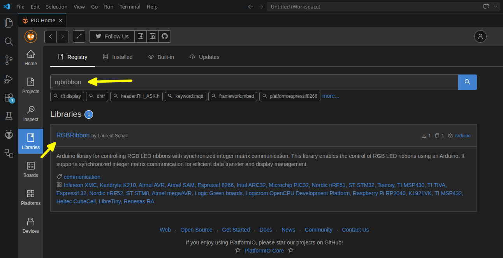
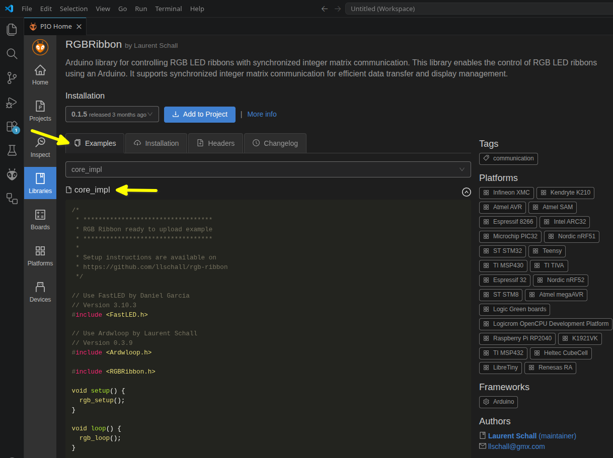
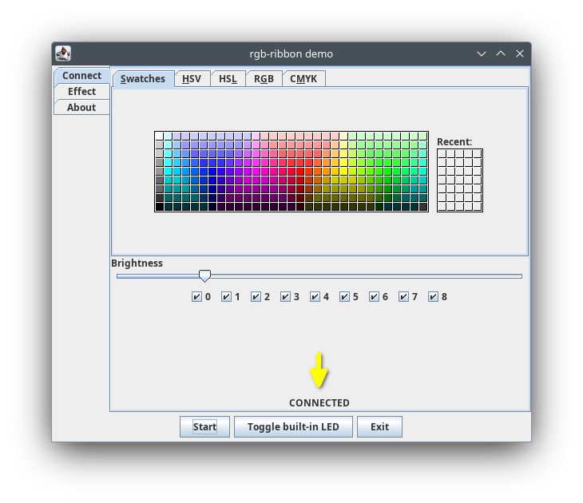

# rgb-ribbon-demo

A lightweight desktop application to control a RGB led strip or ribbon plugged into an Arduino board.


Features the [rgbribbon](https://github.com/llschall/rgb-ribbon) library.

# Demo Setup

## Arduino Setup

### Software

With the PlatformIO extension of VSCode, retrieve the RGBRibbon library:



Without modifying the code, upload the core_impl example to your Arduino board.



### Hardware

Connect the Arduino pin 3 to the data pin of the RGB LED strip.

## Application Setup (Windows / Linux)

Run the following from any folder.

```
git clone https://github.com/llschall/rgb-ribbon-demo;
./rgb-ribbon/gradlew -p rgb-ribbon-demo run;
```

# Demo onboarding

1) Make sure your Arduino board is connected to your computer and the core_impl example is uploaded.
2) If the application is not already running, start it with the following command:

```
./rgb-ribbon/gradlew -p rgb-ribbon-demo run;
```

3) Click the "Start" button to connect to the Arduino board.
   
4) Wait that "CONNECTED" is displayed.
   
5) Click the "Toggle" built-in LED button.<br>
   Each click switches the Arduino board's built-in LED on or off. This might work even without any plugged LED strip.
   
6) If everything works so far, try the other buttons and watch the LED strip reacting. Enjoy!